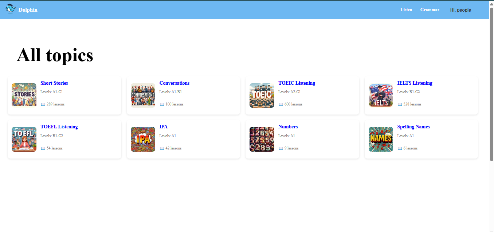
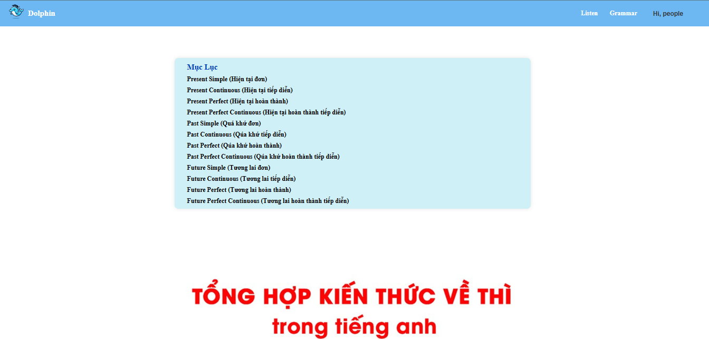
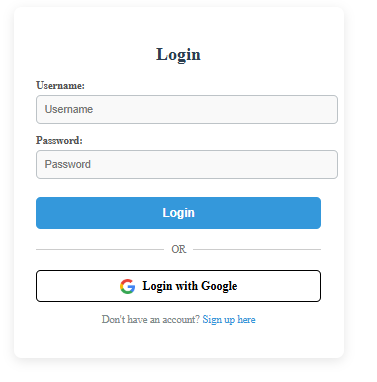
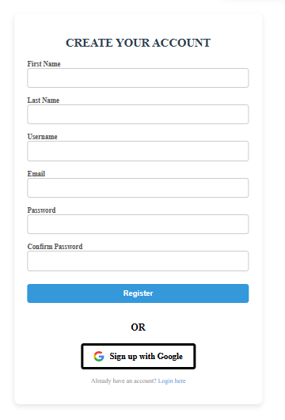
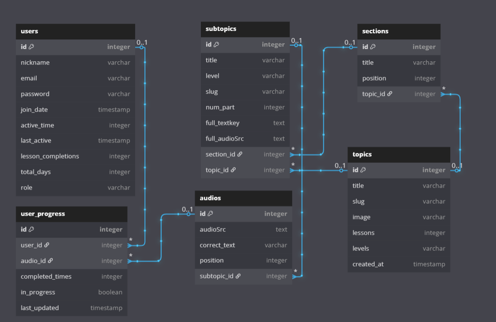

# 🐬 English Assistant Dolphin

**English Assistant Dolphin** is an English learning website designed to help users improve their **listening skills** and master **essential grammar** from levels **A1 to C2**.  
The platform offers a user-friendly learning experience, suitable for both beginners and advanced learners.

---

## 📚 Table of Contents

1. [Installation](#1-installation)  
2. [Features](#2-features)  
   - [Listening](#listening)  
   - [Grammar](#grammar)  
   - [Login](#login)  
   - [Register](#register)  
3. [Technologies Used](#3-technologies-used)  
4. [Database](#4-database)  
5. [Contact](#5-contact)  

---

## 1. 🚀 Installation

### Environment Requirements:
- Python >= 3.8  

### Installation Steps:
```bash
# Clone the project
git clone https://github.com/iuh-application-development/Language-Learning-Assistan1.git
cd English-language-learning-assistant
cd dolphin_english

# Set up virtual environment
python -m venv env
source env/bin/activate  # or env\Scripts\activate on Windows

# Install dependencies
pip install -r requirements.txt

# Run server
python manage.py runserver  # you can change the port if needed
```

---

## 2. 🧠 Features

### 🎧 Listening  

- Listening exercises from A1 to C2 with answer checking functionality  
- Beginner-friendly and intuitive interface

### 🧾 Grammar  
 
- Covers essential to advanced grammar: 12 core grammar topics

### 🔐 Login  
  
- User authentication integrated via Django Allauth

### 📝 Register  

- Users can register to track their learning progress  
- Progress history, scores, and level are stored and displayed

---

## 3. ⚙️ Technologies Used

### Backend & Database:
- **Django**: Main web framework  
- **Python**: Backend programming language  
- **Supabase**: Cloud-based relational database  
- **Django Allauth**: User authentication system

### Frontend:
- **HTML, CSS, JavaScript**: Basic UI implementation

---

## 4. 🗄️ Database

The system uses a relational database model, designed to fully support English learning features such as listening exercises, grammar lessons, progress tracking, and user management.

Here is the system’s database schema:

 

### 📘 Main Tables Description:

#### **1. users**
- Stores user information such as username, email, registration time, number of completed lessons, role, etc.  
- Has one-to-many relationships with: `user_progress`, `user_topics`, and `user_audio_attempts`.

#### **2. topics**
- Represents high-level topics for listening or grammar  
- Fields: `id`, `name`, `slug`, `image`, `lessons`, `level`

#### **3. sections**
- Divides each topic into smaller parts  
- Fields: `id`, `title`, `position`, `topic_id`

#### **4. subtopics**
- Represents sub-lessons within each section  
- Fields: `id`, `title`, `level`, `slug`, `num_part`, `full_textkey`, `full_audioSrc`, `topic_id`, `section_id`

#### **5. audios**
- Contains information about audio files used in listening lessons  
- Fields: `id`, `audioSrc`, `correct_text`, `position`, `subtopic_id`

#### **6. user_progress**
- Tracks user learning progress  
- Fields: `id`, `user_id`, `audio_id`, `completed_time`, `in_progress`, `last_updated`


### 🎥 Database Structure & Diagram


---

## 5. 📬 Contact

**Development Team:**

| Name               | Student ID |
|--------------------|------------|
| Nguyễn Thị Viên     | 22003025   |
| Nguyễn Hữu Phúc     | 22676511   |
| Trần Trọng Trí      | 22665961   |
| Đường Chí Trung     | 22655141   |

---

🎯 **English Assistant Dolphin** – Your companion on the journey to mastering English from beginner to advanced levels!

---

